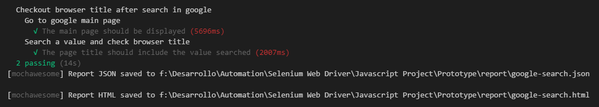
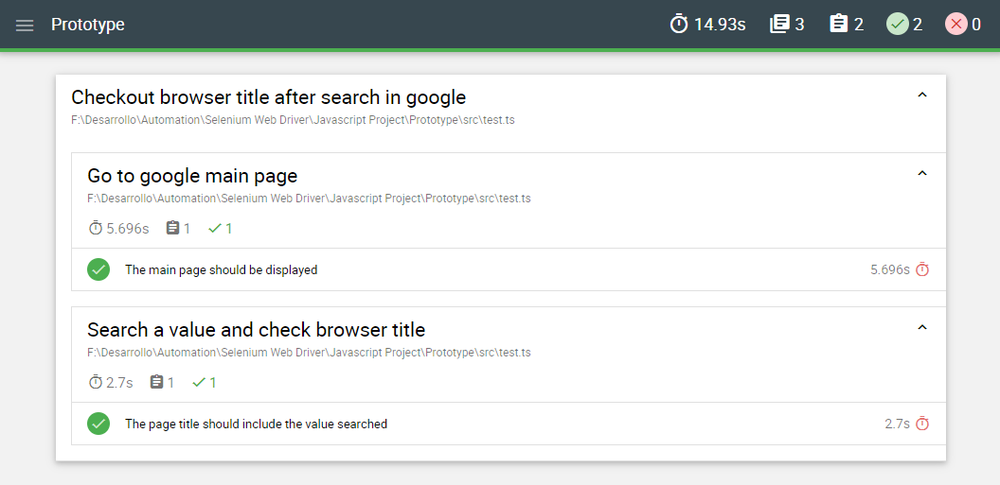

# **WebDriver JS** | prototype example

***

## **Technologies** | *the project was built under...*
- **NodeJS**: is a JavaScript runtime built on Chrome's V8 JavaScript engine. 
- **WebdriverJS (Selenium):** is an umbrella project encapsulating a variety of tools and libraries enabling web browser automation.
- **Mocha:** is a feature-rich JavaScript test framework responsible for defining and running test suites.
- **Chai:** is a BDD / TDD assertion library for node and the browser helping you to implement test suites.
- **Typescript:** is a language for application-scale JavaScript (superset). TypeScript adds optional types to JavaScript.
- **Babel:** is a toolchain that is mainly used to convert ECMAScript 2015+ code into a backwards compatible version of JavaScript in current and older browsers or environments.

**Note:** the project follows the Page Object Model (POM) design pattern, which is based on the Object-Oriented Programming (OOP) paradigm.

***

## **Automated steps** | *proof of concept*

1. Open a browser
2. Go to Google main page
3. Take screenshot
4. Search a specific value
5. Validate new title window value
6. Take screenshot
7. Close the browser

The project was tested against three (3) browsers, which are: **Chrome / Firefox / IE explorer** (defined inside *src/config/config-data.js*).
***
***Expected result in console***

***Expected result in html (Report)***

Using custom reporter [Mochawesome](https://github.com/adamgruber/mochawesome) to generate the html report.

***

## **Objective** | *prototype as example of...*
- *Scalability:* first define a solid structure through which to start the task of mapping different pages (inside *page-objects* folder). 
- *Reusability:* related to the previous point, implementing the POM pattern the idea is to reduce code and focus on functionality. 
- *Flexibility:* in the future if the UI of a specific page change, you only need to adapt/update the page-object impacted (class).
  
***

## **Useful links** | *ideas to follow...*

This project was built thanks to the huge community that surrounds automation testing. Some of the sources were...

- [Selenium webdriver for Javascript](https://seleniumhq.github.io/selenium/docs/api/javascript/index.html)
- [Basic example program in webdriverjs](http://www.webdriverjs.com/example-program-for-webdriverjs/)
- [How to Test Your JavaScript with Selenium WebDriver and Mocha](https://www.sitepoint.com/how-to-test-your-javascript-with-selenium-webdriver-and-mocha/)
- [Selenium + Javascript](https://filipin.eu/selenium-javascript)
- [Page Object Model (POM) | Design Pattern](https://medium.com/tech-tajawal/page-object-model-pom-design-pattern-f9588630800b)
- [Getting Started with Page Object Pattern for Your Selenium Tests](https://www.pluralsight.com/guides/getting-started-with-page-object-pattern-for-your-selenium-tests)
- *Bonus (!)* [The Page Objects anti pattern](https://blog.getgauge.io/are-page-objects-anti-pattern-21b6e337880f)